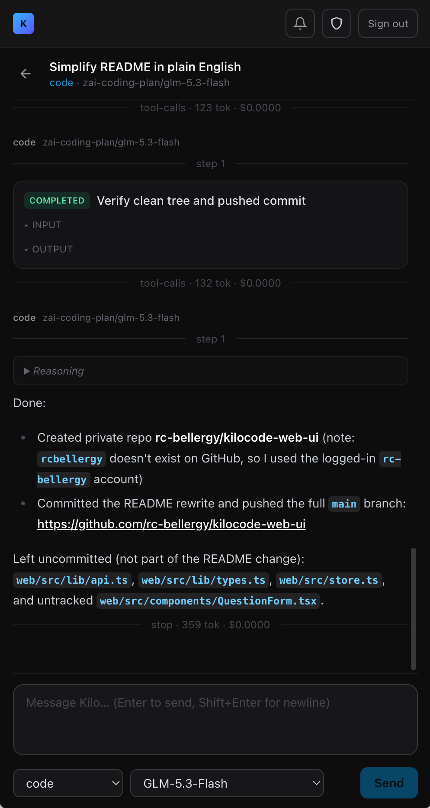

# Kilo Code Web

## About

A self-hosted web app for using [Kilo Code](https://kilo.ai) in the browser. The backend runs on `kilo serve` (the Kilo CLI): it can start a new instance automatically, or attach to one that is already running.



## Goals

- Use Kilo Code without opening VS Code
- Access and monitor agent sessions from any device (phone, tablet, etc.)
- Self-host and self-manage: one Node backend + one password, on your own machine

## Features

- **Password login**: HMAC-signed session cookie; login is rate limited (10 failed tries per minute, per IP and global)
- **Multi-project switcher**: switch projects (worktrees) in the top bar; each has its own session list
- **Session dashboard**: shows busy / retrying / offline status in real time; create and delete sessions
- **Chat**: streaming replies, reasoning, tool call cards, files and subtasks, markdown rendering (with XSS sanitizing)
- **Composer settings**: agent mode and model selection, remembered per browser
- **Permission inbox**: Allow once / Always allow / Reject (with optional feedback)
- **Live updates**: pushed over SSE; auto-reconnects and re-fetches missed data
- **Abort**: stop the agent at any time while it is running
- **Auto recovery**: restarts or reconnects when the kilo server crashes (gives up after 5 failures in a row); the UI shows the status
- **Browser notifications**: system notifications for permission requests and "done", title badge, optional beep (only works while the tab is open)

## Install / Deploy (Docker + OrbStack)

### Requirements

- [OrbStack](https://orbstack.dev) — the local docker default context should be `orbstack` (check with `docker context show`; if you switched to Docker Desktop, run `docker context use orbstack` first)
- Kilo CLI (`kilo` command in PATH)

### Steps

1. Create `.env` in the repo root (see `.env.example`):

   | Variable | Meaning |
   |---|---|
   | `KILO_WEB_PASSWORD` | Web login password (defaults to `kilo` with a log warning if unset; always set this for public deploys) |
   | `KILO_SERVER_PASSWORD` | Basic auth password for kilo serve |
   | `ZEROTIER_IP` | Local ZeroTier interface IP; compose binds the port to it (**required** — `docker compose up` fails if unset/empty, so the port never ends up on 0.0.0.0) |
   | `ALLOWED_IPS` | IP allowlist for native runs, e.g. `127.0.0.1,::1,203.0.113.0/24` |
   | `KILO_SERVE_PORT` | Optional, kilo serve port (default `4096`); `kilo-serve.sh`, `sync-kilo-password.sh`, and compose's `KILO_SERVER_URL` all follow it |

2. Start kilo serve on the host (`127.0.0.1:4096`, Basic auth):

   ```bash
   scripts/kilo-serve.sh
   ```

   To start it at boot: `scripts/install-kilo-serve.sh` (creates a launchd agent from a template, using the current absolute repo path).

   If you attach to the kilo serve spawned by the VS Code extension (port 4096), its password rotates each time the extension restarts. When the dashboard shows `rejected credentials (401)`, run `scripts/sync-kilo-password.sh` to sync the current password and rebuild the container.

3. Build and start the container (the container attaches to the host's kilo serve through `host.docker.internal`; project paths, git, and `~/.config/kilo` all stay on the host):

   ```bash
   docker compose up -d --build
   ```

URLs:

- Local: `http://127.0.0.1:3100` or `http://kilocode-web.orb.local`
- Other ZeroTier devices (phone, etc.): `http://<ZEROTIER_IP>:3100`

Common commands:

```bash
docker compose logs -f   # view logs
docker compose down      # stop
scripts/sync-kilo-password.sh  # on kilo 401: sync the current 4096 password into .env and rebuild the container
```

### Backend environment variables

The backend loads the repo root `.env` on start; **real environment variables always win** (that is how compose's `environment:` overrides `.env`).

| Variable | Default | Meaning |
|---|---|---|
| `KILO_WEB_PASSWORD` | `kilo` | Shared login password for the web UI (defaults to `kilo` with a log warning if unset; always set this for public deploys) |
| `ALLOWED_IPS` | – (allow all) | Comma-separated IP / CIDR allowlist; if set, all routes (health, login, SPA) return 403 for other IPs; a bad entry fails startup |
| `PORT` / `HOST` | `3100` / `0.0.0.0` | Backend listen port / address |
| `KILO_CLI_PATH` | `kilo` | kilo CLI path for spawn mode |
| `KILO_SERVER_URL` | – | Attach mode target (e.g. `http://127.0.0.1:4096`); compose sets it to `host.docker.internal:4096` inside the container |
| `KILO_SERVER_USERNAME` / `KILO_SERVER_PASSWORD` | `kilo` / – | Attach mode Basic auth (spawn mode generates random credentials) |
| `COOKIE_SECURE` | `0` | Set to `1` when serving over HTTPS |
| `ZEROTIER_IP` | – | Used by compose for port binding |

## Development

```bash
npm install        # install dependencies (server + web workspaces)
npm run dev        # backend :3100 (watch) + Vite :5173 (proxies /api)
npm run build      # build backend and frontend
```

Tests:

```bash
npm run test:unit  # server unit tests (vitest)
E2E_BACKEND_PORT=3200 E2E_BASE_URL=http://127.0.0.1:3200 npx playwright test  # E2E (mock kilo; separate port avoids clashing with the dev server on 3100)
npm run test:real  # E2E against a real kilo serve
```

## Security

- **Network layer (Docker)**: the port is only published on `127.0.0.1` + the ZeroTier interface; LAN access to 3100 gets connection refused. Inside the container, compose overrides `ALLOWED_IPS` to empty (from the container, every client IP looks like the OrbStack gateway, so an allowlist is useless there); the defense is port binding.
- **App layer (native)**: when running via `npm start` directly, client IPs are real, the `ALLOWED_IPS` allowlist fully applies, and IPs not listed get 403.
- **Auth**: `KILO_WEB_PASSWORD` defaults to `kilo` (with a startup warning) if unset; always set it for public deploys. The host's kilo serve is protected by `KILO_SERVER_PASSWORD` Basic auth and binds only to `127.0.0.1`, so it is not exposed to the LAN.
- **Secrets**: `.env` is gitignored; secrets are never baked into the Docker image.
- **Sessions**: cookies are signed with a key generated at each startup, so restarting the backend logs everyone out. For public serving, always use HTTPS (or a tunnel) and set `COOKIE_SECURE=1`.
